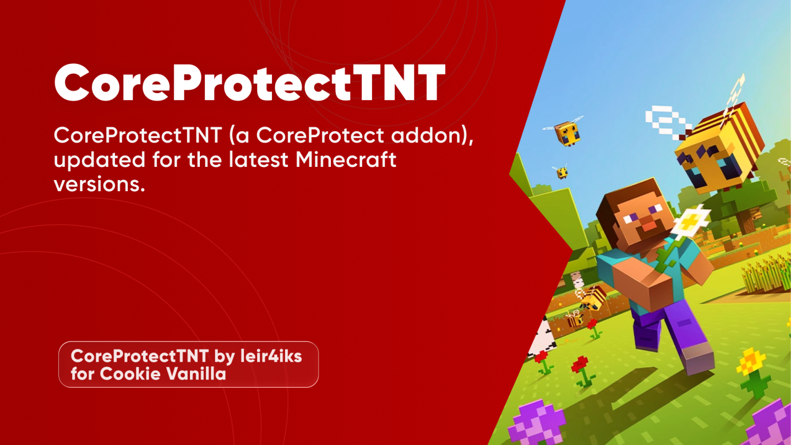

# CoreProtectTNT

[](https://github.com/leir4iks/CoreProtectTNT-updated/releases/)


<div align="center">

```coreprotecttnt.version```
```coreprotecttnt.update```

[](https://bstats.org/plugin/bukkit/CoreProtectTNT/26755)