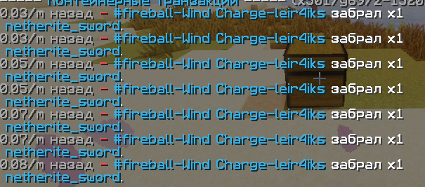

# CoreProtectTNT-updated
A fork of CoreProtectTNT (a CoreProtect addon) that no longer logs Wind Charge events.
A CoreProtect addon allow you log the TNT (or TNTMinecart), Creeper, Ghast, Bed and even ItemFrame breaks!

Previously, firing a Wind Charge at any block or chest would incorrectly log the block as broken or items as removed, even though this wasn't actually the case. 
The old version of CoreProtectTNT misinterpreted Wind Charge impacts as explosions. We have corrected this behavior.

